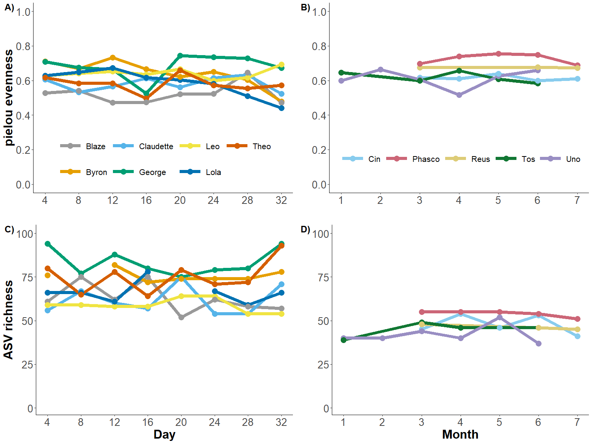
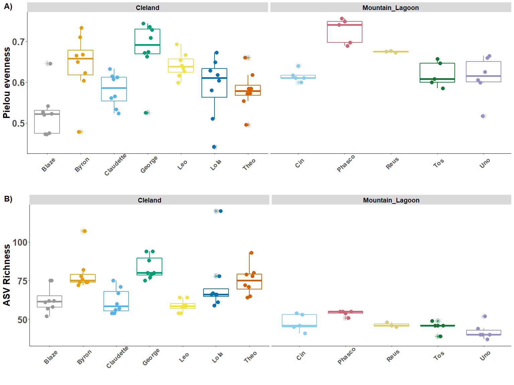
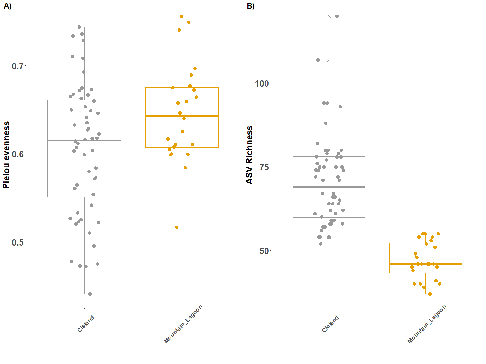
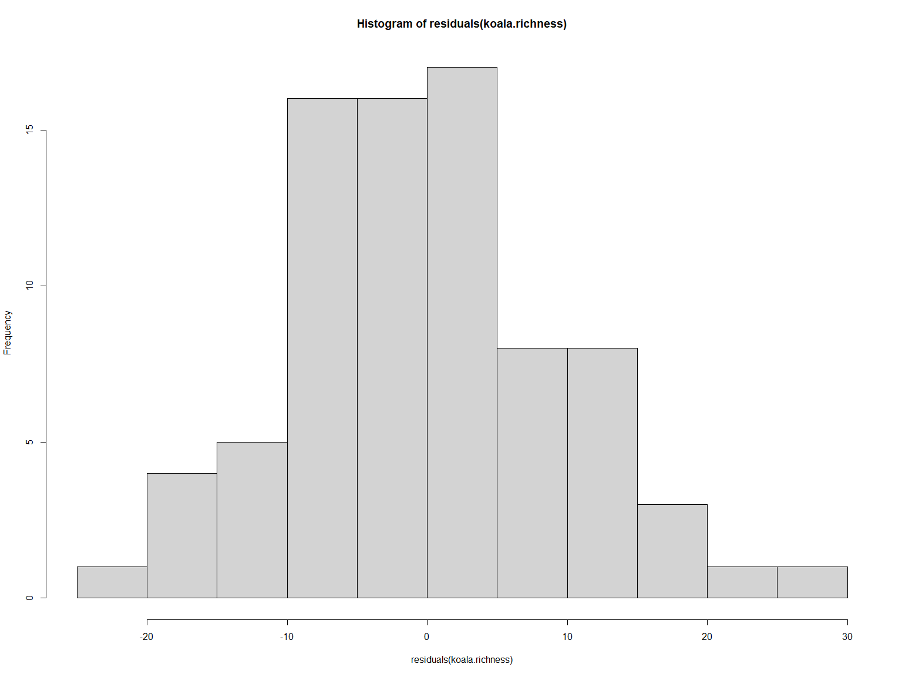
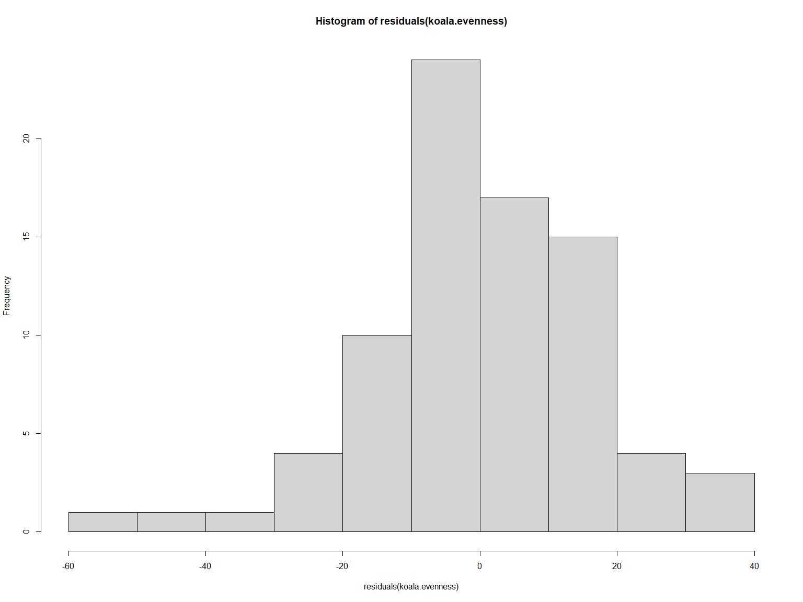
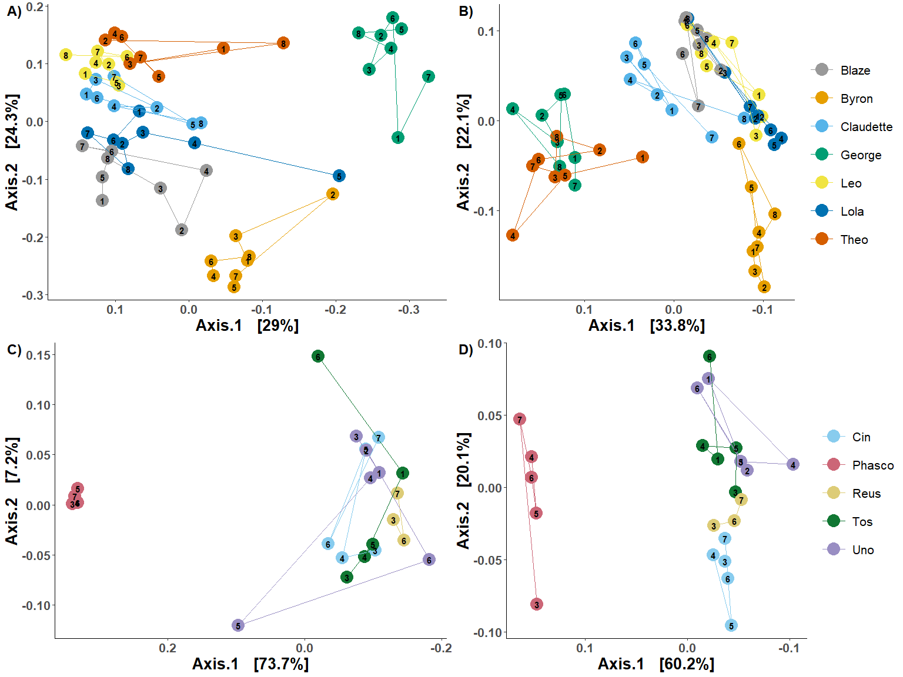
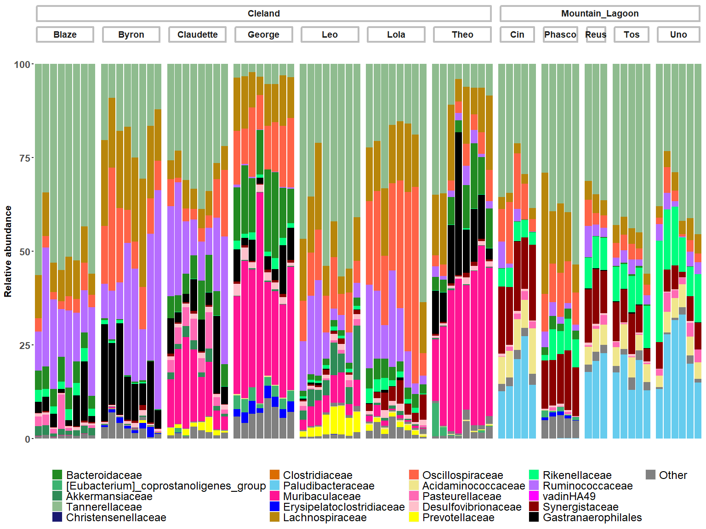
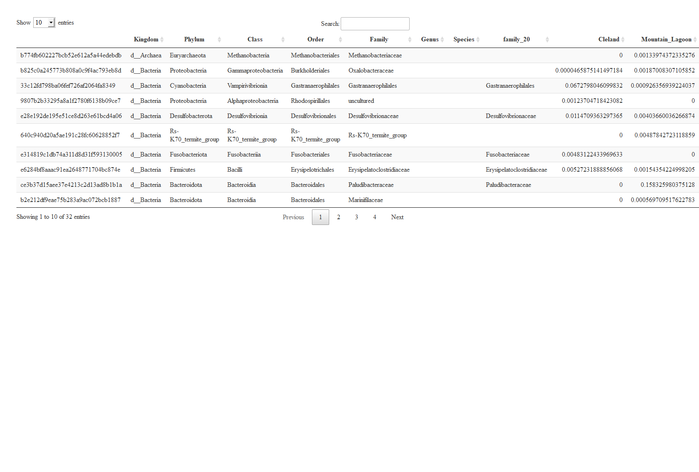

Supplemental analyses for reviewer \#1
================
Raphael Eisenhofer
Oct 11, 2022

-   <a href="#load-packages-import-data"
    id="toc-load-packages-import-data">Load packages, import data</a>
-   <a
    href="#filter-out-asvs-lower-than-025-relative-abundance-for-reviewer-1"
    id="toc-filter-out-asvs-lower-than-025-relative-abundance-for-reviewer-1">Filter
    out ASVs lower than 0.25% relative abundance (for reviewer #1)</a>
-   <a href="#alpha-diversity-through-time-plots-figure-2-si-figures-x--x"
    id="toc-alpha-diversity-through-time-plots-figure-2-si-figures-x--x">Alpha
    diversity through time plots (Figure 2; SI Figures X &amp; X)</a>
-   <a href="#alpha-diversity-stats" id="toc-alpha-diversity-stats">Alpha
    diversity stats</a>
-   <a href="#pcoa-figures-figures-3-and-si-x"
    id="toc-pcoa-figures-figures-3-and-si-x">PCoA figures (Figures 3, and SI
    X)</a>
-   <a href="#beta-diversity-stats"
    id="toc-beta-diversity-stats">Beta-diversity stats</a>
-   <a href="#taxonomic-bar-plots-figure-4"
    id="toc-taxonomic-bar-plots-figure-4">Taxonomic bar plots (Figure 4)</a>
-   <a
    href="#mean-relative-abundances-of-select-microbial-families-between-clml-main-text"
    id="toc-mean-relative-abundances-of-select-microbial-families-between-clml-main-text">Mean
    relative abundances of select microbial families between CL/ML (main
    text)</a>
-   <a href="#venn-diagram-si-figure-x"
    id="toc-venn-diagram-si-figure-x">Venn diagram (SI figure X)</a>
-   <a href="#asv-level-analyses-table-2"
    id="toc-asv-level-analyses-table-2">ASV-level analyses (Table 2)</a>
-   <a href="#lonepinella-prevalanceabundance"
    id="toc-lonepinella-prevalanceabundance">Lonepinella
    prevalance/abundance</a>

## Load packages, import data

``` r
library(phyloseq)
library(qiime2R)
library(ggplot2)
library(scales)
library(microbiome)
```

    ## 
    ## microbiome R package (microbiome.github.com)
    ##     
    ## 
    ## 
    ##  Copyright (C) 2011-2021 Leo Lahti, 
    ##     Sudarshan Shetty et al. <microbiome.github.io>

    ## 
    ## Attaching package: 'microbiome'

    ## The following object is masked from 'package:scales':
    ## 
    ##     alpha

    ## The following object is masked from 'package:ggplot2':
    ## 
    ##     alpha

    ## The following object is masked from 'package:base':
    ## 
    ##     transform

``` r
library(tidyverse)
```

    ## Warning: package 'tidyverse' was built under R version 4.1.3

    ## -- Attaching packages --------------------------------------- tidyverse 1.3.1 --

    ## v tibble  3.1.6     v dplyr   1.0.7
    ## v tidyr   1.1.4     v stringr 1.4.0
    ## v readr   2.1.1     v forcats 0.5.1
    ## v purrr   0.3.4

    ## -- Conflicts ------------------------------------------ tidyverse_conflicts() --
    ## x microbiome::alpha() masks scales::alpha(), ggplot2::alpha()
    ## x readr::col_factor() masks scales::col_factor()
    ## x purrr::discard()    masks scales::discard()
    ## x dplyr::filter()     masks stats::filter()
    ## x dplyr::lag()        masks stats::lag()

``` r
library(ggmap)
```

    ## Google's Terms of Service: https://cloud.google.com/maps-platform/terms/.

    ## Please cite ggmap if you use it! See citation("ggmap") for details.

``` r
library(ggrepel)
library(ggpubr)
```

    ## 
    ## Attaching package: 'ggpubr'

    ## The following object is masked from 'package:qiime2R':
    ## 
    ##     mean_sd

``` r
library(VennDiagram)
```

    ## Loading required package: grid

    ## Loading required package: futile.logger

    ## 
    ## Attaching package: 'VennDiagram'

    ## The following object is masked from 'package:ggpubr':
    ## 
    ##     rotate

``` r
library(osmdata)
```

    ## Data (c) OpenStreetMap contributors, ODbL 1.0. https://www.openstreetmap.org/copyright

``` r
#Import data into phyloseq object
ps <- qza_to_phyloseq(
  features = "analysis/QIIME2/Koala-table.qza",
  tree = "analysis/QIIME2/Koala-sepp-tree.qza",
  taxonomy = "analysis/QIIME2/Koala-SILVA-138.qza",
  metadata = "analysis/QIIME2/Koala_Metadata.tsv"
)
```

# Filter out ASVs lower than 0.25% relative abundance (for reviewer \#1)

``` r
#Rarefy data
ps.rar <- rarefy_even_depth(ps, sample.size = 36622, rngseed = 1337)
```

    ## `set.seed(1337)` was used to initialize repeatable random subsampling.

    ## Please record this for your records so others can reproduce.

    ## Try `set.seed(1337); .Random.seed` for the full vector

    ## ...

    ## 11OTUs were removed because they are no longer 
    ## present in any sample after random subsampling

    ## ...

``` r
#Apply 0.25% relative abundance filter (entire OTU table)
count_cutoff <- 36622 * 0.0025
ps.rar.tablefilter <- filter_taxa(ps.rar, function(x) sum(x > count_cutoff) > (0.0125*length(x)), TRUE)

### 732 ASVs were pruned with this threshold, and these ASVs account for < 2% of the total reads in the dataset
```

# Alpha diversity through time plots (Figure 2; SI Figures X & X)

``` r
#Calculate alpha diversities
ps.rar.tablefilter.div <- alpha(ps.rar.tablefilter, index = "all")
```

    ## Observed richness

    ## Other forms of richness

    ## Diversity

    ## Evenness

    ## Dominance

    ## Rarity

``` r
#Append metadata to alpha diversity values
ps.rar.tablefilter.meta <- meta(ps.rar.tablefilter)
ps.rar.tablefilter.meta$name <- rownames(ps.rar.tablefilter.meta)
ps.rar.tablefilter.div$name <- rownames(ps.rar.tablefilter.div)
ps.rar.tablefilter.div.df <- merge(ps.rar.tablefilter.div, ps.rar.tablefilter.meta, by = "name")


#Set ggplot theme
theme_RE <- theme(axis.text.x = element_text(size=20), 
                  axis.text.y = element_text(size=20),
                  axis.title.x = element_text(size=24, face="bold"),
                  axis.title.y = element_text(size=24, face="bold"),
                  axis.line = element_line(colour = "black"),
                  #Background panel
                  panel.background = element_rect(fill = "White"),
                  panel.grid.major = element_line(colour = "white"), 
                  panel.grid.minor = element_line(colour = "white"),
                  #Legend
                  legend.title = element_blank(),
                  legend.text = element_text(size=16),
                  legend.key = element_rect(fill = "white", color = NA),
                  legend.position = c(0.5, 0.18),
                  legend.direction = "horizontal",
                  legend.key.size = unit(3.5, "line"))

#Set colours
cbp2_cleland <- c("#999999", "#E69F00", "#56B4E9", "#009E73", 
                  "#F0E442", "#0072B2", "#D55E00")

cbp2_mtlagoon <- c("#88CCEE", "#CC6677", "#DDCC77", "#117733", "#998ec3")


#Create each pane of figure 2
plot.evenness.cleland <- ps.rar.tablefilter.div.df %>%
  filter(Location_sampled == "Cleland") %>%
  ggplot(aes(x=Collection_number, y=evenness_pielou, color=Koala)) +
  geom_line(size = 3) +
  geom_point(size = 5) +
  scale_x_continuous(breaks = seq(1, 8, 1), labels = c(
    "1" = "4", "2" = "8", "3" = "12", "4" = "16", 
    "5" = "20", "6" = "24", "7" = "28", "8" = "32"
  )) +
  scale_y_continuous(limits = c(0, 1), breaks = seq(0, 1, 0.2)) +
  xlab(" ") +
  ylab("pielou evenness") +
  scale_color_manual(values = cbp2_cleland) +
  theme_RE


plot.evenness.mtlagoon <- ps.rar.tablefilter.div.df %>%
  filter(Location_sampled != "Cleland") %>%
  ggplot(aes(x=Collection_number, y=evenness_pielou, color=Koala)) +
  geom_line(size = 3) +
  geom_point(size = 5) +
  scale_x_continuous(breaks = seq(1, 8, 1)) +
  scale_y_continuous(limits = c(0, 1), breaks = seq(0, 1, 0.2)) +
  xlab(" ") +
  ylab(" ") +
  scale_color_manual(values = cbp2_mtlagoon) +
  theme_RE


plot.richness.cleland <- ps.rar.tablefilter.div.df %>%
  filter(Location_sampled == "Cleland") %>%
  ggplot(aes(x=Collection_number, y=observed, color=Koala)) +
  geom_line(size = 3) +
  geom_point(size = 5) +
  scale_x_continuous(breaks = seq(1, 8, 1), labels = c(
    "1" = "4", "2" = "8", "3" = "12", "4" = "16", 
    "5" = "20", "6" = "24", "7" = "28", "8" = "32"
  )) +
  scale_y_continuous(limits = c(1, 100), breaks = seq(0, 100, 25)) +
  xlab("Day") +
  ylab("ASV richness") +
  scale_color_manual(values = cbp2_cleland) +
  theme_RE +
  theme(legend.position='none')


plot.richness.mtlagoon <- ps.rar.tablefilter.div.df %>%
  filter(Location_sampled != "Cleland") %>%
  ggplot(aes(x=Collection_number, y=observed, color=Koala)) +
  geom_line(size = 3) +
  geom_point(size = 5) +
  scale_x_continuous(breaks = seq(1, 8, 1)) +
  scale_y_continuous(limits = c(1, 100), breaks = seq(0, 100, 25)) +
  xlab("Month") +
  ylab(" ") +
  scale_color_manual(values = cbp2_mtlagoon) +
  theme_RE +
  theme(legend.position='none') 

#Merge panes into figure 2
ggarrange(plot.evenness.cleland, plot.evenness.mtlagoon,
          plot.richness.cleland, plot.richness.mtlagoon,
          nrow = 2, ncol = 2, common.legend = FALSE, labels = c("A)", "B)", "C)", "D)"), 
          font.label = list(size=18, face="bold", color="black"))
```

    ## Warning: Removed 2 rows containing missing values (geom_point).

<!-- -->

``` r
# ggsave(filename = "output/Figure2.pdf", 
#        width = 16, height = 14, dpi = 300)

##########################################################################################

# Figures SX and SX

#Order samples
ps.rar.tablefilter.div.df$Koala <- factor(ps.rar.tablefilter.div.df$Koala, 
                                          levels = c('Blaze', 'Byron', 'Claudette', 'George', 
                                                    'Leo', 'Lola', 'Theo',
                                                    'Cin', 'Phasco', 'Reus', 'Tos', 'Uno'))
ps.rar.tablefilter.div.df$Koala <- factor(ps.rar.tablefilter.div.df$Koala, 
                                          levels = c('Blaze', 'Byron', 'Claudette', 'George', 
                                                    'Leo', 'Lola', 'Theo',
                                                    'Cin', 'Phasco', 'Reus', 'Tos', 'Uno'))


#Colour theme all
cbp2_all <- c("#999999", "#E69F00", "#56B4E9", "#009E73", "#F0E442", "#0072B2", "#D55E00",
              "#88CCEE", "#CC6677", "#DDCC77", "#117733", "#998ec3")


koala.richness <- ggplot(ps.rar.tablefilter.div.df, aes(x=Koala, y=observed))
koala.evenness <- ggplot(ps.rar.tablefilter.div.df, aes(x=Koala, y=evenness_pielou))

#Set theme
theme_RE2 <- theme(axis.text.x = element_text(face="bold", size=14, angle = 45, vjust = 0.7), 
                   axis.text.y = element_text(face="bold", size=20),
                   axis.title.x = element_text(size=20, face="bold"),
                   axis.title.y = element_text(size=20, face="bold"),
                   axis.line = element_line(colour = "black"),
                   panel.background = element_rect(fill = "White"),
                   strip.text = element_text(colour = "black", face="bold", size = 14),
                   #Legend
                   legend.position = "none")

#Create panes
gg.koala.richness = koala.richness + 
  facet_wrap(~Location_sampled, scales = "free_x") +
  geom_boxplot(size=1, outlier.shape=8, outlier.size=3, outlier.stroke=1, aes(colour=Koala)) +
  geom_jitter(position=position_dodge2(0.3), size=3.5, aes(colour=Koala)) +
  scale_colour_manual(values=cbp2_all) +
  theme_RE2 +
  labs(x = "") +
  labs(y = "ASV Richness")

gg.koala.evenness = koala.evenness + 
  facet_wrap(~Location_sampled, scales = "free_x") +
  geom_boxplot(size=1, outlier.shape=8, outlier.size=3, outlier.stroke=1, aes(colour=Koala)) +
  geom_jitter(position=position_dodge2(0.3), size=3.5, aes(colour=Koala)) +
  scale_colour_manual(values=cbp2_all) +
  theme_RE2 +
  labs(x = "") +
  labs(y = "Pielou evenness")

#Merge panes into SI figure X
ggarrange(gg.koala.evenness, gg.koala.richness,
          nrow = 2, ncol = 1, common.legend = FALSE, labels = c("A)", "B)"), 
          font.label = list(size=18, face="bold", color="black"))
```

<!-- -->

``` r
# ggsave(filename = "output/SI_figure1.pdf", 
#        width = 16, height = 10, dpi = 300)

##########################################################################################

# Cleland vs. Mountain Lagoon
ppn.richness <- ggplot(ps.rar.tablefilter.div.df, aes(x=Location_sampled, y=observed))
ppn.evenness <- ggplot(ps.rar.tablefilter.div.df, aes(x=Location_sampled, y=evenness_pielou))

#Create panes
gg.ppn.richness = ppn.richness + 
  geom_boxplot(size=1, outlier.shape=8, outlier.size=3, outlier.stroke=1, aes(colour=Location_sampled)) +
  geom_jitter(position=position_dodge2(0.3), size=3.5, aes(colour=Location_sampled)) +
  scale_colour_manual(values=cbp2_all) +
  theme_RE2 +
  labs(x = "") +
  labs(y = "ASV Richness")

gg.ppn.evenness = ppn.evenness + 
  geom_boxplot(size=1, outlier.shape=8, outlier.size=3, outlier.stroke=1, aes(colour=Location_sampled)) +
  geom_jitter(position=position_dodge2(0.3), size=3.5, aes(colour=Location_sampled)) +
  scale_colour_manual(values=cbp2_all) +
  theme_RE2 +
  labs(x = "") +
  labs(y = "Pielou evenness")

#Merge panes into SI figure X
ggarrange(gg.ppn.evenness, gg.ppn.richness,
          nrow = 1, ncol = 2, common.legend = FALSE, labels = c("A)", "B)"), 
          font.label = list(size=18, face="bold", color="black"))
```

<!-- -->

``` r
# ggsave(filename = "output/SI_figure2.pdf", 
#        width = 16, height = 10, dpi = 300)
```

# Alpha diversity stats

``` r
library(lme4)
```

    ## Loading required package: Matrix

    ## 
    ## Attaching package: 'Matrix'

    ## The following objects are masked from 'package:tidyr':
    ## 
    ##     expand, pack, unpack

``` r
library(lmerTest)
```

    ## 
    ## Attaching package: 'lmerTest'

    ## The following object is masked from 'package:lme4':
    ## 
    ##     lmer

    ## The following object is masked from 'package:stats':
    ## 
    ##     step

``` r
library(stargazer)
```

    ## 
    ## Please cite as:

    ##  Hlavac, Marek (2018). stargazer: Well-Formatted Regression and Summary Statistics Tables.

    ##  R package version 5.2.2. https://CRAN.R-project.org/package=stargazer

``` r
##Linear model of diversity ~ koala
koala.richness <- lm(rank(observed) ~ Koala, data = ps.rar.tablefilter.div.df)
koala.evenness <- lm(rank(evenness_pielou) ~ Koala, data = ps.rar.tablefilter.div.df)

#ANOVA
anova(koala.richness)
```

    ## Analysis of Variance Table
    ## 
    ## Response: rank(observed)
    ##           Df Sum Sq Mean Sq F value    Pr(>F)    
    ## Koala     11  35387  3217.0   30.31 < 2.2e-16 ***
    ## Residuals 68   7217   106.1                      
    ## ---
    ## Signif. codes:  0 '***' 0.001 '**' 0.01 '*' 0.05 '.' 0.1 ' ' 1

``` r
anova(koala.evenness)
```

    ## Analysis of Variance Table
    ## 
    ## Response: rank(evenness_pielou)
    ##           Df Sum Sq Mean Sq F value    Pr(>F)    
    ## Koala     11  23068 2097.06  7.2784 4.797e-08 ***
    ## Residuals 68  19592  288.12                      
    ## ---
    ## Signif. codes:  0 '***' 0.001 '**' 0.01 '*' 0.05 '.' 0.1 ' ' 1

``` r
#Do the residuals conform to normality?
hist(residuals(koala.richness))
```

<!-- -->

``` r
hist(residuals(koala.evenness))
```

<!-- -->

``` r
shapiro.test(residuals(koala.richness))
```

    ## 
    ##  Shapiro-Wilk normality test
    ## 
    ## data:  residuals(koala.richness)
    ## W = 0.98409, p-value = 0.4235

``` r
shapiro.test(residuals(koala.evenness))
```

    ## 
    ##  Shapiro-Wilk normality test
    ## 
    ## data:  residuals(koala.evenness)
    ## W = 0.9748, p-value = 0.1149

``` r
##Linear model of diversity ~ location sampled (Cleland vs. Mountain Lagoon)
#Using koala as a random effect to account for individual effects
location.richness <- lmer(rank(observed) ~ Location_sampled + (1|Koala), data = ps.rar.tablefilter.div.df)
location.evenness <- lmer(rank(evenness_pielou) ~ Location_sampled + (1|Koala), data = ps.rar.tablefilter.div.df)

summary(location.richness)
```

    ## Linear mixed model fit by REML. t-tests use Satterthwaite's method [
    ## lmerModLmerTest]
    ## Formula: rank(observed) ~ Location_sampled + (1 | Koala)
    ##    Data: ps.rar.tablefilter.div.df
    ## 
    ## REML criterion at convergence: 613.7
    ## 
    ## Scaled residuals: 
    ##      Min       1Q   Median       3Q      Max 
    ## -2.34091 -0.54838 -0.02594  0.55563  2.64415 
    ## 
    ## Random effects:
    ##  Groups   Name        Variance Std.Dev.
    ##  Koala    (Intercept) 123.7    11.12   
    ##  Residual             105.8    10.29   
    ## Number of obs: 80, groups:  Koala, 12
    ## 
    ## Fixed effects:
    ##                                 Estimate Std. Error      df t value Pr(>|t|)
    ## (Intercept)                       52.098      4.422   9.854  11.781 3.98e-07
    ## Location_sampledMountain_Lagoon  -38.513      6.992  10.671  -5.508 0.000205
    ##                                    
    ## (Intercept)                     ***
    ## Location_sampledMountain_Lagoon ***
    ## ---
    ## Signif. codes:  0 '***' 0.001 '**' 0.01 '*' 0.05 '.' 0.1 ' ' 1
    ## 
    ## Correlation of Fixed Effects:
    ##             (Intr)
    ## Lctn_smpM_L -0.632

``` r
summary(location.evenness)
```

    ## Linear mixed model fit by REML. t-tests use Satterthwaite's method [
    ## lmerModLmerTest]
    ## Formula: rank(evenness_pielou) ~ Location_sampled + (1 | Koala)
    ##    Data: ps.rar.tablefilter.div.df
    ## 
    ## REML criterion at convergence: 689.8
    ## 
    ## Scaled residuals: 
    ##      Min       1Q   Median       3Q      Max 
    ## -2.78990 -0.58178 -0.00444  0.64274  1.99960 
    ## 
    ## Random effects:
    ##  Groups   Name        Variance Std.Dev.
    ##  Koala    (Intercept) 267.9    16.37   
    ##  Residual             288.2    16.98   
    ## Number of obs: 80, groups:  Koala, 12
    ## 
    ## Fixed effects:
    ##                                 Estimate Std. Error     df t value Pr(>|t|)    
    ## (Intercept)                       36.929      6.589  9.364   5.605 0.000288 ***
    ## Location_sampledMountain_Lagoon   13.353     10.465 10.318   1.276 0.229941    
    ## ---
    ## Signif. codes:  0 '***' 0.001 '**' 0.01 '*' 0.05 '.' 0.1 ' ' 1
    ## 
    ## Correlation of Fixed Effects:
    ##             (Intr)
    ## Lctn_smpM_L -0.630

``` r
#Tabluate
# stargazer(location.richness, type = "html",
#           digits = 3,
#           star.cutoffs = c(0.05, 0.01, 0.001),
#           digit.separator = "",
#           out = "richness_location.html")

# stargazer(location.evenness, type = "html",
#           digits = 3,
#           star.cutoffs = c(0.05, 0.01, 0.001),
#           digit.separator = "",
#           out = "evenness_location.html")

#Get mean+SD for Cleland vs. Mountain Lagoon
ps.rar.tablefilter.div.df %>%
  group_by(Location_sampled) %>%
  summarise(mean = mean(observed), sd = sd(observed))
```

    ## # A tibble: 2 x 3
    ##   Location_sampled  mean    sd
    ##   <chr>            <dbl> <dbl>
    ## 1 Cleland           70.6 13.6 
    ## 2 Mountain_Lagoon   47.0  5.68

# PCoA figures (Figures 3, and SI X)

``` r
##Split table into cleland and mt lagoon
ps.rar.tablefilter.cl <- subset_samples(ps.rar.tablefilter, Location_sampled == "Cleland")
ps.rar.tablefilter.ml <- subset_samples(ps.rar.tablefilter, Location_sampled == "Mountain_Lagoon")

##calculate beta diversities
#Unweighted UniFrac
ord.unw.uni.cl <- ordinate(ps.rar.tablefilter.cl, "PCoA", "unifrac", weighted=F)
ord.unw.uni.ml <- ordinate(ps.rar.tablefilter.ml, "PCoA", "unifrac", weighted=F)

#Weighted UniFrac
ord.w.uni.cl <- ordinate(ps.rar.tablefilter.cl, "PCoA", "unifrac", weighted=T)
ord.w.uni.ml <- ordinate(ps.rar.tablefilter.ml, "PCoA", "unifrac", weighted=T)

#Axes 1/2
unwt.unifrac.1.2.cl <- plot_ordination(ps.rar.tablefilter.cl, 
                                    ord.unw.uni.cl, color="Koala", 
                                    axes = c(1, 2))
unwt.unifrac.1.2.ml <- plot_ordination(ps.rar.tablefilter.ml, 
                                    ord.unw.uni.ml, color="Koala", 
                                    axes = c(1, 2))

w.unifrac.1.2.cl <- plot_ordination(ps.rar.tablefilter.cl, 
                                 ord.w.uni.cl, color="Koala", 
                                 axes = c(1, 2))
w.unifrac.1.2.ml <- plot_ordination(ps.rar.tablefilter.ml, 
                                 ord.w.uni.ml, color="Koala", 
                                 axes = c(1, 2))
#Axes 1/3
unwt.unifrac.1.3.cl <- plot_ordination(ps.rar.tablefilter.cl, 
                                    ord.unw.uni.cl, color="Koala", 
                                    axes = c(1, 3)) 
unwt.unifrac.1.3.ml <- plot_ordination(ps.rar.tablefilter.ml, 
                                    ord.unw.uni.ml, color="Koala", 
                                    axes = c(1, 3)) 

w.unifrac.1.3.cl <- plot_ordination(ps.rar.tablefilter.cl, 
                                 ord.w.uni.cl, color="Koala", 
                                 axes = c(1, 3))
w.unifrac.1.3.ml <- plot_ordination(ps.rar.tablefilter.ml, 
                                 ord.w.uni.ml, color="Koala", 
                                 axes = c(1, 3))


#Create theme
theme_pcoa <- theme(axis.text.x = element_text(face="bold", size=16), 
                    axis.text.y = element_text(face="bold", size=16),
                    axis.title.x = element_text(size=20, face="bold"),
                    axis.title.y = element_text(size=20, face="bold"),
                    axis.line = element_line(colour = "black"),
                    #Background panel
                    panel.background = element_rect(fill = "White"),
                    panel.grid.major = element_line(colour = "white"), 
                    panel.grid.minor = element_line(colour = "white"),
                    #Legend
                    legend.title = element_blank(),
                    legend.text = element_text(size=16),
                    legend.key = element_rect(fill = "white", color = NA),
                    legend.key.size = unit(2.5, "line"))
          

#Run through plots
#Cleland only

cbp2_beta <- c("#999999", "#E69F00", "#56B4E9", "#009E73", 
               "#F0E442", "#0072B2", "#D55E00")
cl.uw.1.2 <- unwt.unifrac.1.2.cl +
  scale_x_reverse() +
  geom_point(size=7.5) +
  geom_path() +
  geom_text(aes(label = Collection_number), color = "black", fontface = "bold") +
  scale_colour_manual(values=cbp2_beta) +
  theme_pcoa +
  theme(legend.position = "none")

cl.w.1.2 <- w.unifrac.1.2.cl +
  scale_x_reverse() +
  geom_point(size=7.5) +
  geom_path() +
  geom_text(aes(label = Collection_number), color = "black", fontface = "bold") +
  scale_colour_manual(values=cbp2_beta) +
  theme_pcoa +
  theme(legend.position = "right")


#MtLagoon only
cbp2_beta <- c("#88CCEE", "#CC6677", "#DDCC77", "#117733", "#998ec3")

ml.uw.1.2 <- unwt.unifrac.1.2.ml +
  scale_x_reverse() +
  geom_point(size=7.5) +
  geom_path() +
  geom_text(aes(label = Collection_number), color = "black", fontface = "bold") +
  scale_colour_manual(values=cbp2_beta) +
  theme_pcoa +
  theme(legend.position = "none")

ml.w.1.2 <- w.unifrac.1.2.ml +
  scale_x_reverse() +
  geom_point(size=7.5) +
  geom_path() +
  geom_text(aes(label = Collection_number), color = "black", fontface = "bold") +
  scale_colour_manual(values=cbp2_beta) +
  theme_pcoa +
  theme(legend.position = "right")

#Join into SI figure X
ggarrange(cl.uw.1.2, cl.w.1.2, ml.uw.1.2, ml.w.1.2,
          nrow = 2, ncol = 2, common.legend = FALSE, labels = c("A)", "B)", "C)", "D)"), 
          font.label = list(size=18, face="bold", color="black"))
```

<!-- -->

``` r
# ggsave(filename = "output/Figure_3.pdf", 
#        width = 16, height = 10, dpi = 300)
```

# Beta-diversity stats

``` r
library(vegan)
```

    ## Loading required package: permute

    ## Loading required package: lattice

    ## This is vegan 2.5-7

    ## 
    ## Attaching package: 'vegan'

    ## The following object is masked from 'package:microbiome':
    ## 
    ##     diversity

``` r
metadata.cl <- as(sample_data(ps.rar.tablefilter.cl), "data.frame")
metadata.ml <- as(sample_data(ps.rar.tablefilter.ml), "data.frame")

adonis(distance(ps.rar.tablefilter.cl, method="unifrac") ~ Koala, data = metadata.cl)
```

    ## 
    ## Call:
    ## adonis(formula = distance(ps.rar.tablefilter.cl, method = "unifrac") ~      Koala, data = metadata.cl) 
    ## 
    ## Permutation: free
    ## Number of permutations: 999
    ## 
    ## Terms added sequentially (first to last)
    ## 
    ##           Df SumsOfSqs MeanSqs F.Model      R2 Pr(>F)    
    ## Koala      6    2.9229 0.48715  28.245 0.77571  0.001 ***
    ## Residuals 49    0.8451 0.01725         0.22429           
    ## Total     55    3.7680                 1.00000           
    ## ---
    ## Signif. codes:  0 '***' 0.001 '**' 0.01 '*' 0.05 '.' 0.1 ' ' 1

``` r
adonis(distance(ps.rar.tablefilter.ml, method="unifrac") ~ Koala, data = metadata.ml)
```

    ## 
    ## Call:
    ## adonis(formula = distance(ps.rar.tablefilter.ml, method = "unifrac") ~      Koala, data = metadata.ml) 
    ## 
    ## Permutation: free
    ## Number of permutations: 999
    ## 
    ## Terms added sequentially (first to last)
    ## 
    ##           Df SumsOfSqs  MeanSqs F.Model      R2 Pr(>F)    
    ## Koala      4   0.76829 0.192073  13.514 0.73992  0.001 ***
    ## Residuals 19   0.27005 0.014213         0.26008           
    ## Total     23   1.03834                  1.00000           
    ## ---
    ## Signif. codes:  0 '***' 0.001 '**' 0.01 '*' 0.05 '.' 0.1 ' ' 1

``` r
adonis(distance(ps.rar.tablefilter.cl, method="wunifrac") ~ Koala, data = metadata.cl)
```

    ## 
    ## Call:
    ## adonis(formula = distance(ps.rar.tablefilter.cl, method = "wunifrac") ~      Koala, data = metadata.cl) 
    ## 
    ## Permutation: free
    ## Number of permutations: 999
    ## 
    ## Terms added sequentially (first to last)
    ## 
    ##           Df SumsOfSqs MeanSqs F.Model      R2 Pr(>F)    
    ## Koala      6    1.0544 0.17573  24.139 0.74721  0.001 ***
    ## Residuals 49    0.3567 0.00728         0.25279           
    ## Total     55    1.4111                 1.00000           
    ## ---
    ## Signif. codes:  0 '***' 0.001 '**' 0.01 '*' 0.05 '.' 0.1 ' ' 1

``` r
adonis(distance(ps.rar.tablefilter.ml, method="wunifrac") ~ Koala, data = metadata.ml)
```

    ## 
    ## Call:
    ## adonis(formula = distance(ps.rar.tablefilter.ml, method = "wunifrac") ~      Koala, data = metadata.ml) 
    ## 
    ## Permutation: free
    ## Number of permutations: 999
    ## 
    ## Terms added sequentially (first to last)
    ## 
    ##           Df SumsOfSqs  MeanSqs F.Model      R2 Pr(>F)    
    ## Koala      4  0.194845 0.048711  14.811 0.75717  0.001 ***
    ## Residuals 19  0.062487 0.003289         0.24283           
    ## Total     23  0.257331                  1.00000           
    ## ---
    ## Signif. codes:  0 '***' 0.001 '**' 0.01 '*' 0.05 '.' 0.1 ' ' 1

# Taxonomic bar plots (Figure 4)

``` r
library(ggh4x)
library(ggtext)

#Collapse to family level
ps.family <- tax_glom(ps.rar.tablefilter, taxrank = "Family", NArm = FALSE)

#Extract top 20 most abundant family names, bind to ps sampledata
top20families = names(sort(taxa_sums(ps.family), TRUE)[1:20])
taxtab20 = cbind(tax_table(ps.family), family_20 = NA)
taxtab20[top20families, "family_20"] <- as(tax_table(ps.family)
                                           [top20families, "Family"], "character")
tax_table(ps.family) <- tax_table(taxtab20)

ps.family.ra <- transform_sample_counts(ps.family, function(x) 100 * x/sum(x))

#Melt into a dataframe
pd.family <- psmelt(ps.family.ra)

#Replace NA with 'other', for plotting purposes
pd.family <- arrange(pd.family, Koala_Collection)
pd.family$family_20[is.na(pd.family$family_20)] <- c("Other")

#Relative abundance of top 20 families?
mean(sample_sums(prune_taxa(top20families, ps.family.ra)))
```

    ## [1] 98.51737

``` r
#Plot em
#pd.family.plot <- 
  
  ggplot(pd.family, aes(x = Koala_Collection, y = Abundance,
                                        fill = fct_reorder(family_20, -Abundance))) +
  geom_bar(width = 0.9, stat = "identity") +
  facet_nested(~Location_sampled + Koala, scales = "free", space = "free", ) +
  labs(x = "", y = "Relative abundance") +
  theme(
        axis.text.y = element_text(size=16, face = 'bold'),
        axis.title.y = element_text(size=16, face = 'bold'),
        axis.ticks.y = element_line(size = 1),
        axis.ticks.x = element_blank(),
        axis.text.x = element_blank(),
        axis.title.x = element_blank(),
        legend.title = element_blank(),
        legend.text = element_text(size = 18),
        legend.position = "bottom",
        strip.background = element_blank(),
        strip.text = element_textbox_simple(
          padding = margin(5, 0, 5, 0),
          margin = margin(5, 5, 5, 5),
          size = 14,
          face = "bold",
          halign = 0.5,
          fill = "white",
          box.color = "grey",
          linewidth = 1.5,
          linetype = "solid",),
        panel.background = element_blank()
        ) +
  scale_fill_manual(values = 
      c("Bacteroidaceae" = "#228B22", "[Eubacterium]_coprostanoligenes_group" = "#3CB371",
        "Akkermansiaceae" = "#2E8B57", "Tannerellaceae" = "#8FBC8F",
        "Christensenellaceae" = "#191970", "Clostridiaceae" = "#db6d00",
        "Paludibacteraceae" = "#66CCEE", "Muribaculaceae" = "#FF1493",
        "Erysipelatoclostridiaceae" = "#0000FF", "Lachnospiraceae" = "#B8860B",
        "Oscillospiraceae" = "#FF6347", "Acidaminococcaceae" = "#F0E68C",
        "Pasteurellaceae" = "#FF69B4", "Desulfovibrionaceae" = "#FFC0CB",
        "Prevotellaceae" = "#FFFF00", "Rikenellaceae" = "#00FF7F",
        "Ruminococcaceae" = "#b66dff", "vadinHA49" = "#FF00FF",
        "Synergistaceae" = "#8B0000", "Gastranaerophilales" = "#000000", "Other" = "#808080")
  )
```

<!-- -->

``` r
# ggsave(filename = "output/Figure_4.pdf", 
#        width = 20, height = 12, dpi = 300)
```

# Mean relative abundances of select microbial families between CL/ML (main text)

``` r
#Merge samples by geographic location
ps.family.merged <- merge_samples(ps.family, "Location_sampled")
```

    ## Warning in asMethod(object): NAs introduced by coercion

    ## Warning in asMethod(object): NAs introduced by coercion

    ## Warning in asMethod(object): NAs introduced by coercion

    ## Warning in asMethod(object): NAs introduced by coercion

    ## Warning in asMethod(object): NAs introduced by coercion

    ## Warning in asMethod(object): NAs introduced by coercion

    ## Warning in asMethod(object): NAs introduced by coercion

    ## Warning in asMethod(object): NAs introduced by coercion

    ## Warning in asMethod(object): NAs introduced by coercion

    ## Warning in asMethod(object): NAs introduced by coercion

    ## Warning in asMethod(object): NAs introduced by coercion

    ## Warning in asMethod(object): NAs introduced by coercion

    ## Warning in asMethod(object): NAs introduced by coercion

    ## Warning in asMethod(object): NAs introduced by coercion

``` r
ps.family.merged.relab <- transform_sample_counts(ps.family.merged, function(x) x / sum(x))
ps.family.merged.relab@otu_table <- phyloseq::t(ps.family.merged.relab@otu_table)
#Had to transpose otu table, as merge_samples flips it for some reason...

ps.family.merged.relab.tax <- as.data.frame(tax_table(ps.family.merged.relab))
ps.family.merged.relab.otu.and.tax <- cbind(ps.family.merged.relab.tax, 
                                              ps.family.merged.relab@otu_table)

DT::datatable(ps.family.merged.relab.otu.and.tax)
```

<!-- -->

# Venn diagram (SI figure X)

``` r
ps.rar.tablefilter.cl.table <- otu_table(ps.rar.tablefilter.cl)
ps.rar.tablefilter.ml.table <- otu_table(ps.rar.tablefilter.ml)

#For each ASV (row), if abundance > 0, print ASV (rowname) to a vector 
venn.CL <- rownames(ps.rar.tablefilter.cl.table[ apply(ps.rar.tablefilter.cl.table, MARGIN = 1, function(x) any(x > 0))])

venn.ML <- rownames(ps.rar.tablefilter.ml.table[ apply(ps.rar.tablefilter.ml.table, MARGIN = 1, function(x) any(x > 0))])

ppn.comparison <- list("Cleland" = venn.CL, "Mountain Lagoon" = venn.ML)

venn.diagram(ppn.comparison, print.mode = c("raw","percent"), fill = c("red", "blue"), inverted = TRUE, 
             imagetype = "png", filename = "output/SI_figure3.png", cat.pos = c(0,0))
```

    ## [1] 1

``` r
#What are the dominant ASVs that are shared between ppns?
shared.asvs <- inner_join(as.data.frame(venn.CL), as.data.frame(venn.ML), by = c("venn.CL" = "venn.ML"))

shared.asvs.vector <- as.character(shared.asvs$venn.CL)

#Mean relative abundance of shared ASVs
percent(mean(sample_sums(prune_taxa(shared.asvs.vector, ps.rar.tablefilter)))/
  mean(sample_sums(ps.rar.tablefilter)))
```

    ## [1] "33%"

# ASV-level analyses (Table 2)

``` r
library(gridExtra)
```

    ## 
    ## Attaching package: 'gridExtra'

    ## The following object is masked from 'package:dplyr':
    ## 
    ##     combine

``` r
options(digits=3)

##How many ASVs are always present in a given koala through time?
#Create a list of each subset that I want (per koala)
koala_list <- c(
  ps.blaze <- subset_samples(ps.rar.tablefilter, Koala=="Blaze"),
  ps.byron <- subset_samples(ps.rar.tablefilter, Koala=="Byron"),
  ps.cin <- subset_samples(ps.rar.tablefilter, Koala=="Cin"),
  ps.claudette <- subset_samples(ps.rar.tablefilter, Koala=="Claudette"),
  ps.george <- subset_samples(ps.rar.tablefilter, Koala=="George"),
  ps.leo <- subset_samples(ps.rar.tablefilter, Koala=="Leo"),
  ps.lola <- subset_samples(ps.rar.tablefilter, Koala=="Lola"),
  ps.phasco <- subset_samples(ps.rar.tablefilter, Koala=="Phasco"),
  ps.reus <- subset_samples(ps.rar.tablefilter, Koala=="Reus"),
  ps.theo <- subset_samples(ps.rar.tablefilter, Koala=="Theo"),
  ps.tos <- subset_samples(ps.rar.tablefilter, Koala=="Tos"),
  ps.uno <- subset_samples(ps.rar.tablefilter, Koala=="Uno")
)

#Create functions to use in loop
gen_x <- function(ps){
  print(length(taxa_names(filter_taxa(ps, function(x) sum(x) > 0 , TRUE))))
}
gen_y <- function(ps){
  print(length(taxa_names(core(ps, detection =1, prevalence =0.999))))
}
gen_z <- function(ps){
  print(mean(sample_sums(core(ps, detection =1, prevalence =0.999))) / mean(sample_sums(ps)))
}
gen_zz <- function(ps){
  print(length(taxa_names(core(ps, detection = 1, prevalence = 0))) - length(taxa_names(core(ps, detection = 1, prevalence = 1/length(sample_sums(ps))))))
}


#Create dataframe of length koalalist
ASVresults <- data.frame(totalASVs_per_koala=rep(0,length(koala_list)),
                      total_core_ASVs=rep(0,length(koala_list)),
                      mean_rel_abun_core_ASVs=rep(0,length(koala_list)),
                      num_singleton_ASVs_per_koala=rep(0, length(koala_list)))
row.names(ASVresults) <- sort(unique(ps.rar@sam_data$Koala))

#Loop over each subsetted phyloseq object, outputting results into the dataframe!
for (ps in 1:length(koala_list)){
  x <- gen_x(koala_list[[ps]])
  y <- gen_y(koala_list[[ps]])
  z <- gen_z(koala_list[[ps]])
  zz <- gen_zz(koala_list[[ps]])
  ASVresults[ps, 1] <- x
  ASVresults[ps, 2] <- y
  ASVresults[ps, 3] <- z
  ASVresults[ps, 4] <- zz
}
```

    ## [1] 98
    ## [1] 42
    ## [1] 0.993
    ## [1] 16
    ## [1] 120
    ## [1] 53
    ## [1] 0.916
    ## [1] 17
    ## [1] 58
    ## [1] 33
    ## [1] 0.976
    ## [1] 9
    ## [1] 101
    ## [1] 44
    ## [1] 0.992
    ## [1] 17
    ## [1] 120
    ## [1] 65
    ## [1] 0.973
    ## [1] 18
    ## [1] 83
    ## [1] 45
    ## [1] 0.995
    ## [1] 10
    ## [1] 127
    ## [1] 48
    ## [1] 0.992
    ## [1] 42
    ## [1] 58
    ## [1] 45
    ## [1] 0.994
    ## [1] 0
    ## [1] 50
    ## [1] 40
    ## [1] 0.964
    ## [1] 5
    ## [1] 111
    ## [1] 51
    ## [1] 0.942
    ## [1] 13
    ## [1] 58
    ## [1] 31
    ## [1] 0.993
    ## [1] 6
    ## [1] 61
    ## [1] 29
    ## [1] 0.987
    ## [1] 9

``` r
knitr::kable(ASVresults)
```

|           | totalASVs_per_koala | total_core_ASVs | mean_rel_abun_core_ASVs | num_singleton_ASVs_per_koala |
|:----------|--------------------:|----------------:|------------------------:|-----------------------------:|
| Blaze     |                  98 |              42 |                   0.993 |                           16 |
| Byron     |                 120 |              53 |                   0.916 |                           17 |
| Cin       |                  58 |              33 |                   0.976 |                            9 |
| Claudette |                 101 |              44 |                   0.992 |                           17 |
| George    |                 120 |              65 |                   0.973 |                           18 |
| Leo       |                  83 |              45 |                   0.995 |                           10 |
| Lola      |                 127 |              48 |                   0.992 |                           42 |
| Phasco    |                  58 |              45 |                   0.994 |                            0 |
| Reus      |                  50 |              40 |                   0.964 |                            5 |
| Theo      |                 111 |              51 |                   0.942 |                           13 |
| Tos       |                  58 |              31 |                   0.993 |                            6 |
| Uno       |                  61 |              29 |                   0.987 |                            9 |

# Lonepinella prevalance/abundance

``` r
#Get ASV IDs
lp_ids <- tax_table(ps.rar.tablefilter) %>%
                as.data.frame() %>%
                filter(Genus == "Lonepinella") %>%
                row.names()

#Calculate prevalence, min, max, and mean relative abundance
ps.lp.gen <- prune_taxa(lp_ids, ps.rar.tablefilter) %>%
  tax_glom(taxrank = "Genus", NArm = FALSE)
```

    ## Warning in FUN(X[[i]], ...): merge_taxa attempted to reduce tree to 1 or fewer tips.
    ##  tree replaced with NULL.

``` r
ps.rar.gen <- tax_glom(ps.rar.tablefilter, taxrank = "Genus", NArm = FALSE)

mean(sample_sums(ps.lp.gen)/sample_sums(ps.rar.gen)) %>%
  percent(accuracy = 0.01)
```

    ## [1] "1.17%"

``` r
min(sample_sums(ps.lp.gen)/sample_sums(ps.rar.gen)) %>%
  percent(accuracy = 0.01)
```

    ## [1] "0.00%"

``` r
max(sample_sums(ps.lp.gen)/sample_sums(ps.rar.gen)) %>%
  percent(accuracy = 0.01)
```

    ## [1] "9.77%"

``` r
prevalence(ps.lp.gen)
```

    ## 724fe77ff54fcda16bf32851a71114b2 
    ##                            0.825

\#Software/package versions

``` r
sessionInfo()
```

    ## R version 4.1.2 (2021-11-01)
    ## Platform: x86_64-w64-mingw32/x64 (64-bit)
    ## Running under: Windows 10 x64 (build 19044)
    ## 
    ## Matrix products: default
    ## 
    ## locale:
    ## [1] LC_COLLATE=English_Australia.1252  LC_CTYPE=English_Australia.1252   
    ## [3] LC_MONETARY=English_Australia.1252 LC_NUMERIC=C                      
    ## [5] LC_TIME=English_Australia.1252    
    ## 
    ## attached base packages:
    ## [1] grid      stats     graphics  grDevices utils     datasets  methods  
    ## [8] base     
    ## 
    ## other attached packages:
    ##  [1] gridExtra_2.3       ggtext_0.1.1        ggh4x_0.2.1        
    ##  [4] vegan_2.5-7         lattice_0.20-45     permute_0.9-5      
    ##  [7] stargazer_5.2.2     lmerTest_3.1-3      lme4_1.1-27.1      
    ## [10] Matrix_1.3-4        osmdata_0.1.8       VennDiagram_1.7.1  
    ## [13] futile.logger_1.4.3 ggpubr_0.4.0        ggrepel_0.9.1      
    ## [16] ggmap_3.0.0         forcats_0.5.1       stringr_1.4.0      
    ## [19] dplyr_1.0.7         purrr_0.3.4         readr_2.1.1        
    ## [22] tidyr_1.1.4         tibble_3.1.6        tidyverse_1.3.1    
    ## [25] microbiome_1.16.0   scales_1.1.1        ggplot2_3.3.5      
    ## [28] qiime2R_0.99.6      phyloseq_1.38.0    
    ## 
    ## loaded via a namespace (and not attached):
    ##   [1] readxl_1.3.1           backports_1.4.1        Hmisc_4.6-0           
    ##   [4] plyr_1.8.6             igraph_1.2.11          sp_1.4-6              
    ##   [7] splines_4.1.2          crosstalk_1.2.0        GenomeInfoDb_1.30.0   
    ##  [10] digest_0.6.29          foreach_1.5.1          htmltools_0.5.2       
    ##  [13] fansi_0.5.0            magrittr_2.0.1         checkmate_2.0.0       
    ##  [16] cluster_2.1.2          tzdb_0.2.0             Biostrings_2.62.0     
    ##  [19] modelr_0.1.8           jpeg_0.1-9             colorspace_2.0-2      
    ##  [22] rvest_1.0.2            haven_2.4.3            xfun_0.33             
    ##  [25] callr_3.7.0            crayon_1.4.2           RCurl_1.98-1.5        
    ##  [28] jsonlite_1.7.2         survival_3.2-13        iterators_1.0.13      
    ##  [31] ape_5.6-1              glue_1.6.0             gtable_0.3.0          
    ##  [34] zlibbioc_1.40.0        XVector_0.34.0         webshot_0.5.4         
    ##  [37] car_3.0-12             Rhdf5lib_1.16.0        BiocGenerics_0.40.0   
    ##  [40] abind_1.4-5            futile.options_1.0.1   DBI_1.1.2             
    ##  [43] rstatix_0.7.0          Rcpp_1.0.7             gridtext_0.1.4        
    ##  [46] htmlTable_2.4.0        foreign_0.8-81         Formula_1.2-4         
    ##  [49] stats4_4.1.2           DT_0.20                truncnorm_1.0-8       
    ##  [52] htmlwidgets_1.5.4      httr_1.4.2             RColorBrewer_1.1-2    
    ##  [55] ellipsis_0.3.2         pkgconfig_2.0.3        NADA_1.6-1.1          
    ##  [58] farver_2.1.0           sass_0.4.2             nnet_7.3-16           
    ##  [61] dbplyr_2.1.1           utf8_1.2.2             tidyselect_1.1.1      
    ##  [64] labeling_0.4.2         rlang_0.4.12           reshape2_1.4.4        
    ##  [67] cachem_1.0.6           munsell_0.5.0          cellranger_1.1.0      
    ##  [70] tools_4.1.2            cli_3.1.0              generics_0.1.1        
    ##  [73] ade4_1.7-18            broom_0.7.11           evaluate_0.14         
    ##  [76] biomformat_1.22.0      fastmap_1.1.0          yaml_2.2.1            
    ##  [79] processx_3.5.2         knitr_1.37             fs_1.5.2              
    ##  [82] RgoogleMaps_1.4.5.3    nlme_3.1-153           formatR_1.11          
    ##  [85] xml2_1.3.3             compiler_4.1.2         rstudioapi_0.13       
    ##  [88] curl_4.3.2             png_0.1-7              ggsignif_0.6.3        
    ##  [91] zCompositions_1.3.4    reprex_2.0.1           bslib_0.4.0           
    ##  [94] stringi_1.7.6          ps_1.6.0               highr_0.9             
    ##  [97] markdown_1.1           nloptr_1.2.2.3         multtest_2.50.0       
    ## [100] vctrs_0.3.8            pillar_1.6.4           lifecycle_1.0.1       
    ## [103] rhdf5filters_1.6.0     jquerylib_0.1.4        data.table_1.14.2     
    ## [106] cowplot_1.1.1          bitops_1.0-7           R6_2.5.1              
    ## [109] latticeExtra_0.6-29    IRanges_2.28.0         codetools_0.2-18      
    ## [112] lambda.r_1.2.4         boot_1.3-28            MASS_7.3-54           
    ## [115] assertthat_0.2.1       rhdf5_2.38.0           rjson_0.2.21          
    ## [118] withr_2.4.3            S4Vectors_0.32.3       GenomeInfoDbData_1.2.7
    ## [121] mgcv_1.8-38            parallel_4.1.2         hms_1.1.1             
    ## [124] rpart_4.1-15           minqa_1.2.4            rmarkdown_2.17        
    ## [127] carData_3.0-5          Rtsne_0.15             numDeriv_2016.8-1.1   
    ## [130] Biobase_2.54.0         lubridate_1.8.0        base64enc_0.1-3

> > > > > > > 471c56890aa76b70372842ffd6f7916fbb7e89d4
